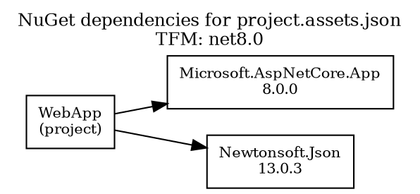
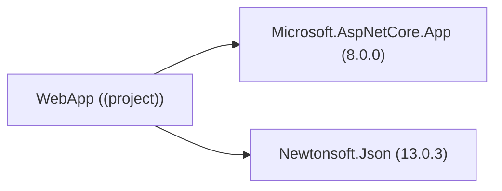
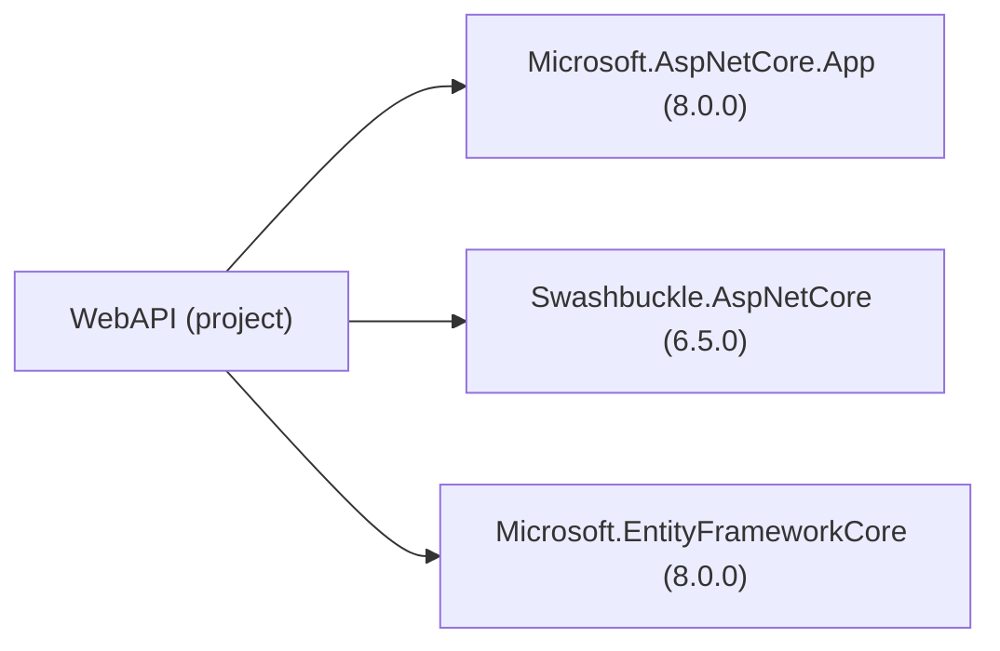
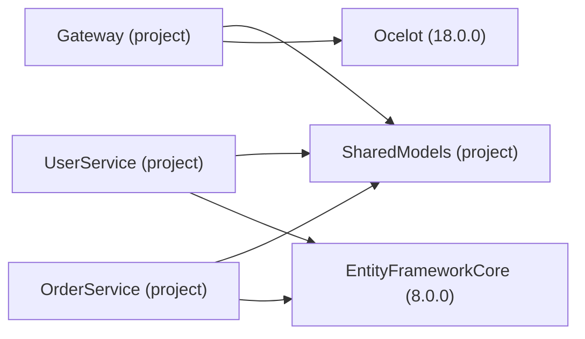

# 📚 Usage Examples (TBD)

This document provides comprehensive examples of using the NuGet Dependency Graph Analyzer in various scenarios.

## 🎯 Basic Usage Examples

### Example 1: Analyze Current Directory
```bash
dotnet run "."
```

**Expected Output:**
```
🔍 NuGet Dependency Graph Analyzer
==================================
📂 Output directory: C:\MyProjects\WebApp
🕐 Session started: 2024-12-09 14:30:22

🔄 Analyzing: .
--------------------------------------------------
📄 Found assets: obj\project.assets.json
🎯 Target Framework: net8.0
🔗 Building package dependency graph...
📦 Processing project references...
📊 Found 8 nodes and 12 dependencies

💾 DOT saved to: C:\...\WebApp_dependencies_20241209_143022.dot
🖼️ PNG saved to: C:\...\WebApp_dependencies_20241209_143022.png
📐 SVG saved to: C:\...\WebApp_dependencies_20241209_143022.svg
📁 Location: C:\MyProjects\WebApp
🖼️ Opening PNG image...
✅ Graph file opened successfully!
🖼️ PNG image opened - save or share this visual graph!
```

**Generated DOT File:**


### Example 2: Generate Mermaid Format
```bash
dotnet run "." "--mermaid"
```

**Generated Mermaid File:**


### Example 3: Target Specific Framework
```bash
dotnet run "MyProject.csproj" "--tfm=net6.0"
```

**Output:**
```
📄 Found assets: obj\project.assets.json
🎯 Target Framework: net6.0
🔗 Building package dependency graph...
📊 Found 5 nodes and 7 dependencies
```

## 🏗️ Complex Project Examples

### Example 4: Multi-Project Solution
**Project Structure:**
```
MySolution/
├── WebApp/
│   ├── WebApp.csproj
│   └── References: BusinessLogic, DataAccess
├── BusinessLogic/
│   ├── BusinessLogic.csproj  
│   └── References: DataAccess
├── DataAccess/
│   ├── DataAccess.csproj
│   └── References: Entity Framework
└── Tests/
    ├── Tests.csproj
    └── References: WebApp, xUnit
```

**Command:**
```bash
dotnet run "MySolution/WebApp"
```

**Generated Graph Structure:**
```
WebApp/(project) → BusinessLogic/(project)
WebApp/(project) → DataAccess/(project)  
WebApp/(project) → Microsoft.AspNetCore.App/8.0.0
BusinessLogic/(project) → DataAccess/(project)
DataAccess/(project) → Microsoft.EntityFrameworkCore/8.0.0
Tests/(project) → WebApp/(project)
Tests/(project) → xunit/2.4.2
```

### Example 5: Large Enterprise Project
**Typical Output for Complex Project:**
```
📊 Found 47 nodes and 89 dependencies

Projects analyzed:
- MainApp/(project)
- Core.Services/(project)  
- Core.Models/(project)
- Infrastructure.Data/(project)
- Infrastructure.Logging/(project)

Key dependencies:
- Microsoft.AspNetCore.App/8.0.0
- Microsoft.EntityFrameworkCore/8.0.0
- Serilog/3.1.1
- AutoMapper/12.0.1
- FluentValidation/11.7.1
```

## 🎨 Visualization Examples

### Example 6: Simple Web API Dependencies


### Example 7: Microservices Architecture


## 🔧 Interactive Mode Examples

### Example 8: Interactive Session
```bash
dotnet run
```

**Interactive Session:**
```
🔍 NuGet Dependency Graph Analyzer
==================================
📂 Output directory: C:\MyProjects
🕐 Session started: 2024-12-09 14:30:22

Enter project path (.csproj, project folder, or project.assets.json):
Or type 'exit' to quit, 'help' for options
> WebApp

🔄 Analyzing: WebApp
--------------------------------------------------
📄 Found assets: WebApp\obj\project.assets.json
🎯 Target Framework: net8.0
📊 Found 8 nodes and 12 dependencies
💾 DOT saved to: C:\...\WebApp_dependencies_20241209_143500.dot
🖼️ PNG saved to: C:\...\WebApp_dependencies_20241209_143500.png
✅ Analysis completed successfully!

> BusinessLogic --mermaid

🔄 Analyzing: BusinessLogic
--------------------------------------------------  
📄 Found assets: BusinessLogic\obj\project.assets.json
🎯 Target Framework: net8.0
📊 Found 4 nodes and 6 dependencies
💾 Mermaid saved to: C:\...\BusinessLogic_dependencies_20241209_143530.mmd
✅ Analysis completed successfully!

> help

📚 Help - Usage Options:
  <path>                    - Path to .csproj, folder, or project.assets.json
  <path> --mermaid          - Output in Mermaid format (.mmd)
  <path> --tfm=net8.0       - Specify target framework

> exit
Goodbye! 👋
```

## 📊 Real-World Use Cases

### Example 9: Dependency Audit
**Scenario:** Security audit requiring dependency mapping

**Command:**
```bash
dotnet run "Enterprise.WebApp" "--out" "security-audit.dot"
```

**Use case:** Generate comprehensive dependency map for security team review, identifying all third-party packages and their versions.

### Example 10: Architecture Documentation  
**Scenario:** Creating architecture diagrams for documentation

**Command:**
```bash
dotnet run "Microservices.sln" "--mermaid"
```

**Use case:** Generate Mermaid diagrams for GitHub README files, architectural decision records (ADRs), and technical documentation.

### Example 11: CI/CD Integration
**Scenario:** Automated dependency analysis in build pipeline

**Command:**
```bash
dotnet run "${{ github.workspace }}" "--out" "artifacts/dependencies.dot"
```

**Use case:** Generate dependency graphs as build artifacts, track dependency changes over time, and integrate with automated security scanning.

## 🚨 Troubleshooting Examples

### Example 12: Missing project.assets.json
**Error:**
```
❌ Unable to resolve project directory.
   Tried: C:\MyProject
```

**Solution:**
```bash
# Run restore first
dotnet restore MyProject
dotnet run "MyProject"
```

### Example 13: Graphviz Not Found
**Warning:**
```
⚠️ Graphviz not found - install it for PNG/SVG generation
   Download: https://graphviz.org/download/
```

**Result:** Only DOT and Mermaid files generated (PNG/SVG skipped)

### Example 14: Framework Not Found
**Error:**
```
❌ TFM 'net7.0' not present in 'targets'.
```

**Solution:**
```bash
# Check available frameworks first
dotnet run "MyProject" "--tfm=net8.0"
```

## 📈 Performance Examples

### Example 15: Large Solution Analysis
**Project:** Enterprise solution with 50+ projects, 200+ NuGet packages

**Performance:**
```
Analysis time: ~15 seconds
Generated files: 4 formats  
Total file size: ~2.5MB
Memory usage: ~150MB peak
```

**Optimization tip:** Use specific TFM filtering for faster analysis:
```bash
dotnet run "LargeSolution" "--tfm=net8.0"
```

---

💡 **Pro Tips:**
- Use PNG files for presentations and documentation
- Use Mermaid files for GitHub READMEs and wikis  
- Use DOT files for advanced Graphviz customization
- Use SVG files for scalable web graphics
