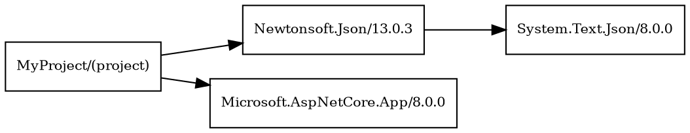
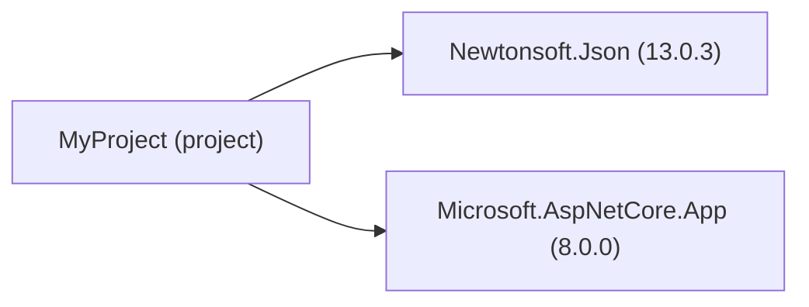

# 🔍 NuGet Dependency Graph Analyzer

A powerful .NET console tool that analyzes and visualizes NuGet package dependencies for .NET projects. Generate beautiful dependency graphs in multiple formats including DOT, Mermaid, PNG, and SVG.


## ✨ Features

- 🔄 **Automatic Discovery** - Analyzes `.csproj`, `project.assets.json`, or project folders
- 🎯 **Multi-Format Output** - DOT (Graphviz), Mermaid, PNG, SVG
- 🖼️ **Visual Graphs** - High-quality PNG and SVG image generation
- 📁 **Smart File Management** - Timestamped output files with auto-opening
- 🔗 **Project References** - Handles complex multi-project solutions
- 🎨 **Target Framework Support** - Filter by specific TFM (e.g., net8.0)
- 💻 **Interactive Mode** - User-friendly console interface
- 🚀 **Auto-Restore** - Runs `dotnet restore` when needed

## 🚀 Quick Start

### Prerequisites

- **.NET 8.0 SDK** or later
- **Graphviz** (optional, for PNG/SVG generation) - [Download here](https://graphviz.org/download/)

### Installation

1. Clone the repository:
```bash
git clone https://github.com/yourusername/nuget-dependency-analyzer.git
cd nuget-dependency-analyzer
```

2. Build the project:
```bash
dotnet build
```

3. Run the analyzer:
```bash
dotnet run
```

## 📖 Usage

### Interactive Mode
Simply run without arguments for interactive mode:
```bash
dotnet run
```

### Command Line Mode
```bash
# Analyze current project
dotnet run "."

# Analyze specific project
dotnet run "C:\Path\To\MyProject.csproj"

# Generate Mermaid format
dotnet run "." "--mermaid"

# Specify target framework
dotnet run "." "--tfm" "net8.0"

# Custom output file
dotnet run "." "--out" "my-dependencies.dot"
```

### Usage Examples

**Analyze a project folder:**
```bash
dotnet run "C:\MyProjects\WebApp"
```

**Generate Mermaid diagram:**
```bash
dotnet run "C:\MyProjects\WebApp" "--mermaid"
```

**Target specific framework:**
```bash
dotnet run "MyProject.csproj" "--tfm=net8.0"
```

## 📊 Output Formats

The tool automatically generates multiple formats:

### 📄 Source Formats
- **`.dot`** - Graphviz DOT format for advanced visualization tools
- **`.mmd`** - Mermaid format for GitHub, documentation, and web tools

### 🖼️ Visual Formats (requires Graphviz)
- **`.png`** - High-quality raster images perfect for presentations
- **`.svg`** - Scalable vector graphics for web and print

### Example Output Structure
```
MyProject_dependencies_20241209_143022.dot
MyProject_dependencies_20241209_143022.mmd  
MyProject_dependencies_20241209_143022.png  
MyProject_dependencies_20241209_143022.svg  
```

## 📈 Example Outputs

### DOT Format (Graphviz)


### Mermaid Format


## 🛠️ Advanced Features

### Project References Support
Analyzes complex solutions with multiple projects:
```
SolutionRoot/
├── WebApp/ (project)
├── BusinessLogic/ (project)  
├── DataAccess/ (project)
└── Tests/ (project)
```

### Target Framework Filtering
Focus on specific frameworks:
```bash
dotnet run "." "--tfm=net8.0"     # .NET 8
dotnet run "." "--tfm=net6.0"     # .NET 6
dotnet run "." "--tfm=netstandard2.0"  # .NET Standard
```

### Multi-Project Analysis
Automatically discovers and maps project references:
- Direct project-to-project dependencies
- NuGet packages used by each project
- Transitive dependency chains
- Version conflicts and duplicates

## 🔧 Configuration

### Help Command
```bash
dotnet run help
```

### Interactive Commands
When running in interactive mode:
- `help` - Show usage options
- `exit` - Quit the application
- `<path>` - Analyze project at path
- `<path> --mermaid` - Generate Mermaid format

## 📋 Output Log Example

```
🔍 NuGet Dependency Graph Analyzer
==================================
📂 Output directory: C:\MyProjects\WebApp
🕐 Session started: 2024-12-09 14:30:22

🔄 Analyzing: C:\MyProjects\WebApp
--------------------------------------------------
📄 Found assets: obj\project.assets.json
🎯 Target Framework: net8.0
🔗 Building package dependency graph...
📦 Processing project references...
   📁 Found project reference: BusinessLogic
📊 Found 15 nodes and 23 dependencies

💾 DOT saved to: C:\...\WebApp_dependencies_20241209_143022.dot
🖼️ PNG saved to: C:\...\WebApp_dependencies_20241209_143022.png
📐 SVG saved to: C:\...\WebApp_dependencies_20241209_143022.svg
📁 Location: C:\MyProjects\WebApp
🖼️ Opening PNG image...
✅ Graph file opened successfully!
🖼️ PNG image opened - save or share this visual graph!
--------------------------------------------------
✅ Analysis completed successfully!
📁 Check the generated files above for graph visualization
💡 PNG files work best for viewing and sharing
```

## 🎨 Visualization Tools

### For DOT Files
- **Graphviz Desktop** - Official Graphviz application
- **VS Code** - Install Graphviz extension
- **Online Viewer** - [GraphvizOnline](https://dreampuf.github.io/GraphvizOnline/)

### For Mermaid Files  
- **GitHub Markdown** - Native support in README files
- **Mermaid Live Editor** - [mermaid.live](https://mermaid.live/)
- **VS Code** - Install Mermaid extension

### For PNG/SVG Files
- Any image viewer or browser
- Perfect for documentation, presentations, and sharing

## 🤝 Contributing

1. Fork the repository
2. Create your feature branch (`git checkout -b feature/amazing-feature`)
3. Commit your changes (`git commit -m 'Add amazing feature'`)
4. Push to the branch (`git push origin feature/amazing-feature`)
5. Open a Pull Request

## 📝 License

This project is licensed under the MIT License - see the [LICENSE](LICENSE) file for details.

## 🙏 Acknowledgments

- **Graphviz** - For excellent graph visualization capabilities
- **Mermaid** - For beautiful diagram syntax and rendering
- **.NET Community** - For comprehensive tooling and ecosystem

## 📞 Support

- 🐛 **Issues**: [GitHub Issues](https://github.com/yourusername/nuget-dependency-analyzer/issues)
- 💡 **Feature Requests**: [GitHub Discussions](https://github.com/yourusername/nuget-dependency-analyzer/discussions)
- 📚 **Documentation**: [Wiki](https://github.com/yourusername/nuget-dependency-analyzer/wiki)

---

⭐ **Star this repo** if it helps you visualize your project dependencies!
